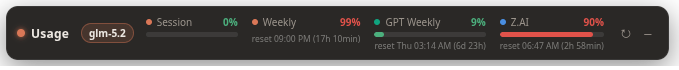

# Agent Usage Widget

See your **Claude**, **GPT/Codex**, and **Z.AI** usage limits in one compact desktop strip.
It stays above the taskbar, refreshes in the background, and shows both utilization and
reset time without making you open three dashboards.



| Provider | What the widget reads | Local setup |
| :--- | :--- | :--- |
| Claude | Session, weekly, and model-specific limits | Signed-in Claude Code |
| GPT/Codex | Rate-limit windows from the official Codex app server | Signed-in Codex CLI |
| Z.AI | Coding Plan token quota and peak-hour status | `ZAI_API_KEY` |

Inspired by the taskbar *essential-mode* look of
[claude-usage-widget](https://github.com/niccolo-sabato/claude-usage-widget), but built on
Electron + plain HTML/CSS/JS and extended into a multi-provider agent usage widget.

## Features

- **Lives on the panel/taskbar** — docks to the bottom-right, flush above the taskbar or
  panel, always on top, out of the way of your work. Toggle from the tray ("Dock to panel");
  turn it off to float and drag it anywhere.
- **Three providers, isolated** — Claude, GPT/Codex, and Z.AI fetch independently, so one being down or
  missing a key never blanks out the other.
- **Active-model pill** — a pill next to the title shows which Claude Code model you're
  using right now, auto-detected from your newest session transcript (no setup). When that
  model is one of the shown limits, its row is tagged **Active**. Updates each poll, so it
  follows model switches without restarting the widget.
- **Quiet, readable bars** — thin severity-colored progress bars (green / amber / red) with
  the percentage above. The Weekly + per-model limits collapse into one stacked cell
  (percent only, no bars) to save horizontal space; their shared reset is shown once.
- **Reset countdowns** in the `reset 22:10 (50min)` / `reset Thu 08:59 (4d 19h)` style.
- **GLM peak-hours indicator** — the Z.AI cell turns amber with a live countdown
  badge (`peak ends in 2h 05m`) next to its label while inside GLM's Coding Plan
  peak window, where quota is billed at 2×; the quota-reset line stays untouched.
  Outside the window the cell is normal and the next peak start appears in its
  tooltip. Claude has no active peak (its throttle was removed in May 2026), so
  only Z.AI is flagged.
- **Usage history + leak detection** — every poll is appended to a local daily log with how
  far each meter moved. Quota that climbs while no local agent has run for 15+ minutes is
  flagged as an **idle drain** — the signature of a leaked key, a forgotten background job,
  or a session still running somewhere else. Read it back with `npm run log`.
- **No telemetry, keys stay local** — data goes only to each provider's own usage endpoint.
  No key ships with the repo (`.env` is gitignored); no token or key is ever written,
  logged, or sent anywhere else.
- **Independent provider toggles** — enable or disable Claude, GPT/Codex, and Z.AI from
  the tray. Only enabled providers are polled.

## How it works

**Claude** (`src/usage.js`)
- Reads the OAuth access token Claude Code already stores at `~/.claude/.credentials.json`
  **fresh on every poll**. Claude Code keeps that token refreshed, so the overlay rides
  along and never runs its own OAuth refresh flow.
- Polls the same endpoint the Claude CLI uses:
  `GET https://api.anthropic.com/api/oauth/usage` (`anthropic-beta: oauth-2025-04-20`).
- Shows the 5-hour session, weekly (all models), and per-model (scoped, e.g. Fable) limits.

**GPT/Codex** (`src/gpt.js`)
- Uses the official `codex app-server` interface and its `account/rateLimits/read`
  method to read ChatGPT/Codex usage windows.
- Reuses your local Codex login. Codex owns OAuth storage and token refresh; this widget
  never reads, logs, or sends the token itself.
- Shows every returned primary/secondary or named usage bucket, including utilization,
  reset countdown, and severity. Install the Codex CLI and run `codex login` once.
- You can override the executable with `CODEX_BIN` or `codexPath` in the widget config.

**Z.AI** (`src/zai.js`)
- Polls `GET https://api.z.ai/api/monitor/usage/quota/limit` with
  `Authorization: Bearer <ZAI_API_KEY>`.
- Shows the TOKENS_LIMIT row with a reset countdown.
- **Peak hours** (`src/peak.js`): GLM's Coding Plan charges **2× quota** Mon–Fri
  **14:00–18:00 UTC+8** (Beijing) — off-peak is 50%. In Thailand (UTC+7) that's
  **13:00–17:00**, Mon–Fri. The window is computed against the Beijing clock, so it
  stays correct in any timezone. While active, the Z.AI cell goes amber with a
  countdown; Claude is not flagged, since Anthropic removed its peak throttle in
  May 2026. Set `CU_PEAK_FORCE=peak|off` at launch to preview either state.
- Key resolution order (first hit wins): `ZAI_API_KEY` env var → `zaiApiKey` in config →
  the widget's own `.env` file at the project root. No path or key is bundled with the
  repo — copy `.env.example` to `.env` and add your key (`.env` is gitignored), or run
  `npm run setup` to do it for you.
- Toggle on/off from the tray ("Providers").

## Usage history & leak detection

A live percentage tells you *where* you are, not *where it went*. The widget therefore keeps
a history: every poll is reduced to one line — what each meter read, how far it moved since
the last poll, how fast that is per hour, and who was working at the time — appended to
`logs/usage-YYYY-MM-DD.jsonl` in the same `userData` folder as the config.

```jsonc
{"t":"2026-08-07T10:22:53.338Z",
 "usage":{"claude/session":56,"claude/weekly":10,"gpt/codex:primary":51,"zai/tokens":100},
 "resets":{"claude/session":"2026-08-07T11:40:00.000Z", …},
 "idle":{"claude":0,"gpt":1558.3,"zai":0},      // minutes since that agent last ran
 "active":"Opus", "deltaMin":3,
 "delta":{"claude/session":2}, "rate":{"claude/session":40},
 "alerts":[{"type":"idle-drain","level":"warn","metric":"claude/session","delta":2,
            "idleMin":90,"message":"claude/session +2% while no local agent ran for 90 min"}]}
```

### What gets flagged

"Is anyone actually working?" is answered from the transcripts each CLI writes while it
runs — `~/.claude/projects/**.jsonl` for Claude Code, `~/.codex/sessions/**.jsonl` for
Codex (`src/activity.js`). Claude's meters are judged against Claude Code's transcripts,
GPT's against Codex's, and Z.AI's against either, since GLM is usually driven through one
of them. An unknown idle time is never treated as idle, so an unused CLI can't raise alarms.

| alert | means | what to do |
|---|---|---|
| `idle-drain` | quota grew while no local agent had run for 15+ min | look for another machine or service on the same key, a background job left running, or a leaked key — then rotate it |
| `burn-rate` | at the last 30 minutes' pace, the window hits 100% before it resets | something is looping, or it's time to slow down |
| `spike` | 10+ points in a single interval | one very expensive run — worth knowing which |
| `window-reset` | the meter fell: its window rolled over | informational, so a summary can tell a reset apart from a lost baseline |
| `provider-error` | a provider started (or stopped) failing | logged on change, not on every poll |

Alerts are throttled per metric (a drain reports every 15 min, not every poll) — but **every
delta is always recorded**, so the totals stay exact no matter how the alerts are summarized.
Long gaps (app closed overnight) are recorded but never blamed on one interval, and a
provider recovering from its cache can't fake a spike.

### Reading it back

```sh
npm run log                 # today
npm run log -- --days 7     # last 7 calendar days
npm run log -- --alerts     # only the warnings
npm run log -- -m claude    # only metrics matching "claude"
npm run log -- --json       # summary + hourly buckets as JSON
```

```
metric              start   now  peak   used   idle  resets
claude/session         5%   33%   99%   +124    +28  1
claude/weekly         31%   42%   42%    +11      -  0

By hour
  2026-08-07 08:00Z  claude/session +32 (28 idle)   claude/weekly +1

⚠ Alerts (4)
  08/07, 03:07 PM  idle-drain   claude/session +2% while no local agent ran for 90 min
```

`used` counts points gained across the range and survives window resets; `idle` is how many
of those points burned with nobody working — the number to worry about.

From the tray: **Usage log** → *Record usage history* (on/off), *Open today's log*,
*Open log folder*. Files older than `logRetentionDays` (30) are deleted automatically.
Only percentages, plan names, reset times and provider error messages are written — never a
token, a key, or any prompt content.

## Install

Requires Node.js 22.12 or newer.

```sh
npm install      # first time only
npm run setup    # one-time: creates your local .env and shows which providers are ready
npm start
```

`npm run setup` copies `.env.example` → `.env` (if you don't already have one), then
reports which providers are ready. Claude needs no key (it reuses Claude Code's OAuth token);
GPT needs a locally installed and signed-in Codex CLI; Z.AI needs `ZAI_API_KEY` in your
`.env` (or as an env var). It also drops a clickable launcher: an **Agent Usage Widget**
desktop shortcut on Windows, or an app-menu entry
(`~/.local/share/applications/…`) on Linux — double-click to launch (no console window).

## Run

```sh
npm start
```

Or launch it silently (no console window):

- **Windows** — double-click **`start-overlay.vbs`**.
- **Linux** — run **`./start-overlay.sh`**, or open **Agent Usage Widget** from your app
  menu after `npm run setup`.

Both clear `ELECTRON_RUN_AS_NODE`, which some parent shells (VS Code's remote server,
Claude Code's own runtime) set and which would otherwise stop Electron from starting a GUI.
(`npm start` already clears it cross-platform via `scripts/start.js`.)

## Providers

Toggle each provider independently from the tray (**Providers** submenu). Only enabled
providers are polled:

- **Claude** — enabled by default; reads `~/.claude/.credentials.json`.
- **GPT (Codex)** — enabled by default; uses your signed-in Codex CLI session.
- **Z.AI** — enabled by default; needs `ZAI_API_KEY`.

## Controls

- **↻** refresh now. **–** collapse the strip to just its title chip (click **□** to expand
  again; the state is remembered across restarts).
- **Tray icon** (right-click) → Refresh, **Providers** (independent toggles),
  Dock to panel (on/off), Click-through, Always on top (forced on while docked),
  **Usage log** (record on/off, open today's log, open the folder), Opacity,
  Launch at login, Show / Hide, Quit.
- **Show / hide** the whole overlay: click the tray icon or press **Ctrl+Shift+U** (works
  even when fully hidden).
- While docked, dragging is disabled so it stays pinned; turn "Dock to panel" off to move
  it freely (position is remembered).

## Config

Settings persist to `overlay-config.json` in Electron's `userData` folder
(`%APPDATA%\agent-usage-widget` on Windows, `~/.config/agent-usage-widget` on Linux,
`~/Library/Application Support/agent-usage-widget` on macOS). On first run after the
rename, existing `claude-usage-widget` settings are migrated automatically. Notable keys:

| key | default | purpose |
|-----|---------|---------|
| `taskbarMode` | `true` | dock to the bottom-right |
| `opacity` | `0.95` | window opacity (0.3–1.0) |
| `clickThrough` | `false` | let mouse clicks pass through to windows behind |
| `alwaysOnTop` | `true` | stay above other windows (forced on while docked) |
| `pollSeconds` | `180` | refresh interval |
| `collapsed` | `false` | start collapsed to the title chip |
| `claudeEnabled` | `true` | poll the Claude provider |
| `gptEnabled` | `true` | poll GPT/Codex rate limits through the Codex CLI |
| `zaiEnabled` | `true` | poll the Z.AI provider |
| `codexPath` | `null` | custom Codex executable; `null` auto-discovers PATH and common user-local installs such as NVM |
| `zaiApiKey` | — | explicit Z.AI key (overrides `.env`) |
| `zaiEnvPath` | `null` | custom `.env` path; `null` = project-root `.env` |
| `launchOnStartup` | `false` | start at login |
| `loggingEnabled` | `true` | record usage history to `logs/` |
| `logRetentionDays` | `30` | delete daily log files older than this |
| `logHeartbeatMinutes` | `15` | log an unchanged snapshot at least this often |
| `logIdleMinutes` | `15` | no local agent transcript for this long counts as idle |
| `logSpikePoints` | `10` | single-interval jump that gets flagged |

## Severity colors

| % utilization | color |
|---------------|-------|
| < 70          | green |
| 70–89         | amber |
| ≥ 90          | red   |

## Files

| File | Purpose |
|------|---------|
| `src/main.js`    | window, tray, panel/taskbar dock, polls all enabled providers, IPC |
| `src/usage.js`   | Claude: token read + `/api/oauth/usage` fetch + normalize |
| `src/gpt.js`     | GPT/Codex: official app-server rate-limit fetch + normalize |
| `src/active-model.js` | detect the currently-used Claude Code model from the newest session transcript |
| `src/usage-log.js` | usage history: snapshot, deltas, idle-drain / burn-rate alerts, retention |
| `src/activity.js` | how long since each local agent (Claude Code, Codex) last ran |
| `src/peak.js`    | GLM Coding Plan peak-window detection (Mon–Fri 14:00–18:00 UTC+8, 2× quota) |
| `src/zai.js`     | Z.AI: key read + quota endpoint fetch + normalize |
| `src/config.js`  | settings persistence + defaults |
| `src/autostart.js` | start-at-login (XDG autostart on Linux, login item elsewhere) |
| `src/preload.js` | contextBridge IPC surface (incl. `setSize` auto-width) |
| `src/icon.js`    | embedded tray icon |
| `src/renderer/`  | the strip UI — `index.html`, `styles.css`, `renderer.js` |
| `scripts/start.js` | cross-platform launcher (`npm start`) — clears `ELECTRON_RUN_AS_NODE`, Linux sandbox fallback |
| `scripts/setup.js` | `npm run setup` — creates `.env`, desktop/app-menu launcher, provider readiness |
| `scripts/usage-log.js` | `npm run log` — read the usage history back: totals, hourly gains, alerts |
| `.env.example`   | template for your gitignored `.env` (set `ZAI_API_KEY`) |
